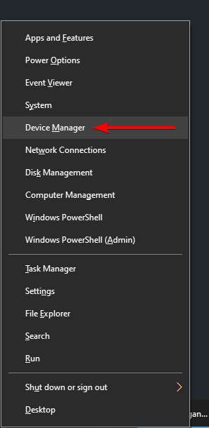
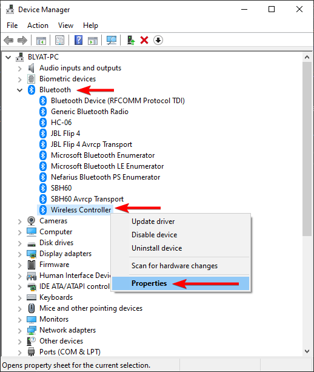
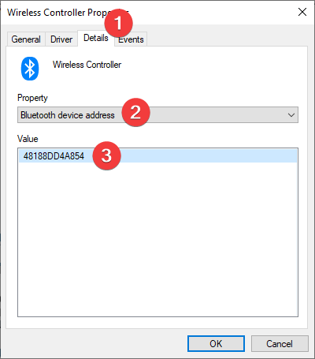
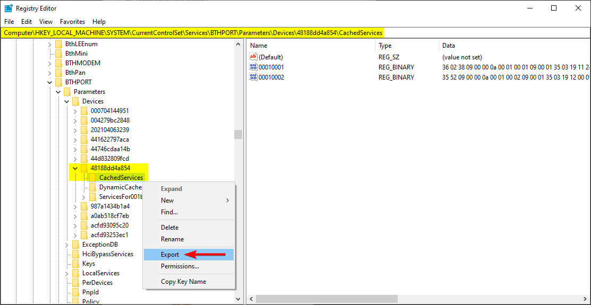

# Exporting SDP records

## Target audience

If you have one or more of the following listed game controllers **connected wireless via Bluetooth**:

- Sony DualShock 4 (Rev1 or Rev2)
- Sony DualSense
- Nintendo JoyCons
- Nintendo Pro Wireless Controller

If you do and want to help this project, read on!

## Why

To test and improve the SDP parser and patcher, the authors need real-world samples to feed it into the parser. This little guide shows how to do it in two simple steps. Your contribution is apprechiated 🤩

## Find your Controllers MAC address

Press `Win + X` and open **Device Manager**:

Expand the `Bluetooth` node and look for your controller entry (in this example it's `Wireless Controller`) and right-click, open **Properties**:

In the upcoming dialog navigate to `Details` tab and select the property `Bluetooth device address`:

This value is required for the next step.

## Find and export SDP records

Press `Win + R` and open `regedit`. Then navigate to `Computer\HKEY_LOCAL_MACHINE\SYSTEM\CurrentControlSet\Services\BTHPORT\Parameters\Devices`, identify the sub-key with the address noted in the previous step, right-click on `CachedServices` and select **Export**:

Store the resulting `.reg` file at a location of your choice and share it with @nefarius 😃
